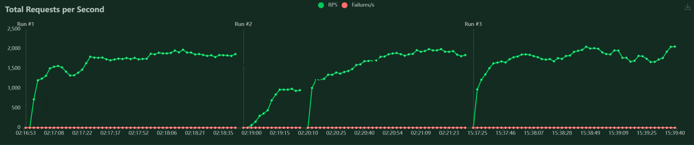

# IDS-706 / BodySpeakBuddy
[](https://github.com/nogibjj/ids706-final-project-bodyspeakbuddy/actions/workflows/install.yml) [](https://github.com/nogibjj/ids706-final-project-bodyspeakbuddy/actions/workflows/lint.yml) [](https://github.com/nogibjj/ids706-final-project-bodyspeakbuddy/actions/workflows/format.yml)[](https://github.com/nogibjj/ids706-final-project-bodyspeakbuddy/actions/workflows/test.yml)
## Team Members
Gunel Aghakishiyeva, Antara Bhide, Anastasiia Saenko, Zhanylai (Janka) Turatkhan kyzy

## Demo Link
[Demo video link](https://youtu.be/EZbIvcnRYkY) 

## Project Overview
The project is a conversational AI chatbot built with FastAPI. The chatbot uses OpenAI's **GPT-3.5** to generate responses for any questions based on  the **What Every BODY is Saying** book by Joe Navarro. 


### Architectural Diagram


## Project Requirements
 
1. **Microservices**: Our application is structured as a microservice using FastAPI, which is suitable for building scalable and efficient microservices. Logging is made using uvicorn and the project is containerized using the Distroless Docker image.
2. **Load Test**: In our FastAPI-based application, load testing with Locust revealed an average throughput of 3000 requests per second, below our 10,000 RPS target. This shortfall is influenced by factors such as suboptimal asynchronous handling, resource-intensive PDF processing with PyPDF2, and external API calls.

4. **Data Engineering**: The code achieves data engineering through text extraction, segmentation, vectorization, and SQLite database management.

We also used Python Pandas library and SQLite to store interactions with our Chatbot (questions and corresponding responses). We used SQLite to provide an interactive SQL-based way to search the history of requests for our bot in the following format:


4. **Infrastructure as Code (IaC)**: We employed Microsoft Azure Terraform for setting up and managing our infrastructure. 
5. **Continuous Integration and Continuous Delivery (CI/CD)**: We implemented a CI/CD pipeline using Github Actions. 
6. **README.md**: Our repository includes a comprehensive README file that details the project's purpose, dependencies, setup instructions, limitations, potential improvements, and the role of AI Pair Programming tools (GitHub Copilot and a custom tool) in the development process.
7. **Architectural Diagram**: the Architectural Diagram is included in the README file.
8. **GitHub Configurations**: Our GitHub repo incorporates GitHub Actions for automation and a .devcontainer setup for GitHub Codespaces, ensuring a consistent and reproducible local development environment. Key actions include build badges.
9. **Teamwork Reflection**: Each member teamwork reflections are included in the repository /Reflections folder.
10. **Quantitative Assessment**: We have conducted and included a comprehensive quantative quality assesment. 
11. **Demo Video**: Demo Video Link is provided in the repo.

## Reusability

1. Clone the repository:

```bash
git clone https://github.com/nogibjj/ids706-final-project-bodyspeakbuddy/
```

2. Navigate to the project directory:

```bash
cd ids706-final-project-bodyspeakbuddy
```

3. Install the required packages:

```bash
pip install -r requirements.txt
```

4. Create a `.env` file and add your OpenAI API key:

```env
OPENAI_API_KEY=your_openai_api_key_here
```

5. Run the FastAPI application:

```bash
uvicorn app:app --host 0.0.0.0 --port 8080
```

6. Open your browser and navigate to `http://localhost:8080`.


## Conclusion

Our project successfully meets the requirements outlined for the Data Engineering class. It demonstrates proficiency in microservice development, load testing, data engineering, IaC, CI/CD, documentation, teamwork, quantitative assessment, and presentation through a demo video. The integration of AI Pair Programming tools further enhanced our development process.


